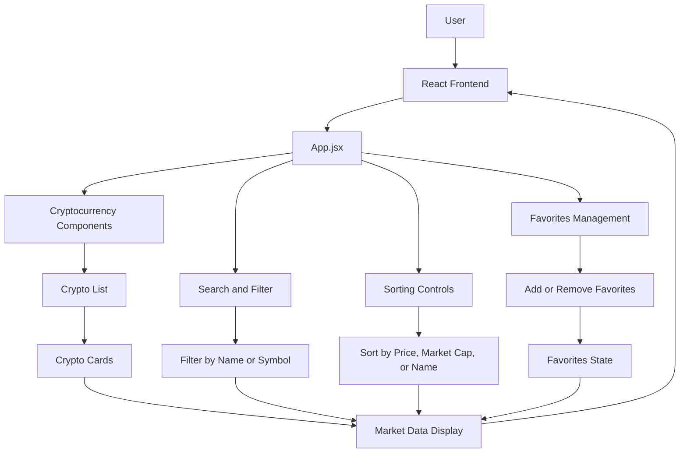

# CryptoPulse — Cryptocurrency Tracking Application

CryptoPulse is a lightweight and responsive cryptocurrency tracking application built with **React and Vite**.

The application allows users to monitor cryptocurrency market data, search for assets, sort cryptocurrencies by key metrics, and manage a personalized list of favorite coins through a clean and responsive interface.

## Features

### Cryptocurrency Search

Search and filter cryptocurrencies instantly by:

- Coin name
- Cryptocurrency symbol

### Market Data Sorting

Sort cryptocurrency data by:

- Price
- Market capitalization
- Name

### Favorites Management

- Add cryptocurrencies to your favorites list.
- Remove cryptocurrencies from your favorites list.
- Manage preferred coins through a simple interface.

### Responsive Interface

Optimized for different screen sizes:

- Desktop
- Tablet
- Mobile

### Fast Development Workflow

Built with **Vite** for fast development startup and Hot Module Replacement (HMR).

### Component-Based Architecture

Uses reusable React components to improve:

- Maintainability
- Scalability
- Code organization
- Reusability

## Tech Stack

| Technology | Purpose |
|---|---|
| React | UI development and component architecture |
| Vite | Development server and build tooling |
| JavaScript (ES6+) | Application logic |
| CSS | Styling and responsive layouts |
| HTML5 | Application structure |

## System Architecture

The application follows a component-based frontend architecture. Users interact with the React interface to browse cryptocurrency market data, search for coins, sort market information, and manage their favorite cryptocurrencies.



## Project Architecture

```text
User
  ↓
React Frontend
  ↓
App.jsx
  ├── Cryptocurrency Components
  ├── Search and Filter
  ├── Sorting Controls
  └── Favorites Management
  ↓
Market Data Processing
  ↓
Cryptocurrency List and Cards
  ↓
Responsive User Interface
```

## Getting Started

### Prerequisites

Make sure the following tools are installed:

- Node.js
- npm
- Git

### Installation

Clone the repository:

```bash
git clone https://github.com/arjuniverse/SpendWise.git
cd SpendWise
```

> Replace the repository URL and folder name with your actual CryptoPulse repository details if they are different.

Install the dependencies:

```bash
npm install
```

### Run the Development Server

Start the application locally:

```bash
npm run dev
```

Vite will provide a local development URL in your terminal.

### Build for Production

Create a production build:

```bash
npm run build
```

### Preview the Production Build

Preview the production build locally:

```bash
npm run preview
```

## Project Structure

```text
CryptoPulse/
├── public/
├── src/
│   ├── components/
│   │   ├── CryptoCard.jsx
│   │   ├── CryptoList.jsx
│   │   ├── SearchBar.jsx
│   │   └── ...
│   ├── App.jsx
│   ├── main.jsx
│   └── ...
├── index.html
├── package.json
├── vite.config.js
└── README.md
```

> The component names above are examples. Update the structure to match the actual files in your project.

## Usage

Once the application is running, you can:

1. Browse available cryptocurrencies.
2. Search for a coin by name or symbol.
3. Sort market data by price, market capitalization, or name.
4. Add coins to your favorites list.
5. Remove coins from your favorites list.
6. Use the application across desktop, tablet, and mobile devices.

## Future Improvements

Potential improvements include:

- Cryptocurrency price charts
- Real-time market updates
- Detailed coin information pages
- Portfolio tracking
- Price alerts
- Dark and light theme support
- Persistent favorites using LocalStorage
- Additional market statistics

## License

This project is currently available for personal and educational use.

Add an appropriate license to the repository if required.

## Contributors

Add contributor names and project information here.
